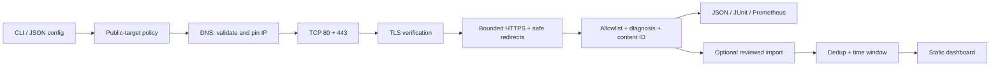

# Runet Blackbox

**Сбой сборки — или сбой сети? Узнайте, на каком слое ломается доступ к публичным зависимостям.**

Локальный preflight для CI-runner’ов и распределённых команд: DNS → TCP → TLS → HTTP, объяснимый результат и готовые артефакты для разбора инцидента. Без аккаунта, центрального сервера и автоматической отправки данных.

[](docs/VERIFICATION.md)
[](package.json)
[](src/)
[](CHANGELOG.md)
[](package-lock.json)
[](LICENSE)

> Local evidence for engineering teams. This is **not** an application E2E monitor, SLA calculator, VPN, or proof of censorship. The local-check badge refers to the supplied verification report, not a completed GitHub Actions run. Version 0.4.0 is supplied as source; no npm publication is implied.

## Почему это полезно

- 🔎 **Один диагностический путь.** Проверенный DNS-адрес закрепляется за TCP/TLS/HTTP; основной резолвер действительно определяет путь.
- 🛡 **Безопасные границы.** Проверка сертификатов, блокировка private/reserved-адресов и небезопасных редиректов, ограниченные время и размер ответа.
- 🧪 **Готово для CI.** `preflight` возвращает `2`, если хотя бы одна проверка не прошла. JSON, JUnit XML и Prometheus textfile записываются локально.
- ⚙️ **Конфигурация как код.** Набор `ci`, список целей или JSON-конфиг с индивидуальными ожидаемыми HTTP-кодами.
- 🔒 **Минимизация данных.** Allowlist полей, округление времени, исключение сырых DNS-ответов, HTTP-данных и деталей сертификатов.
- 📋 **Сводка без ложной уверенности.** Дедупликация, окно 24 часа, отделение неизвестных результатов и VPN-помеченных измерений. Демо — только по запросу.

## Старт за 60 секунд

Нужен **Node.js 22+** с актуальными security patches. Находясь в распакованной папке `runet-blackbox`:

```bash
npm ci --ignore-scripts --no-audit
node cli/bin/runet-blackbox.js preflight --config config.example.json --json --output out/preflight.json
```

Вторая команда делает реальные исходящие проверки GitHub, npm и PyPI. Разрешите их в вашей сети. Код `2` означает результат диагностики, а не сбой установки. Команда ничего не публикует.

Без доступа в интернет можно проверить запуск и формат отчёта:

```bash
node cli/bin/runet-blackbox.js sample --pretty
```

## Практические сценарии

**Перед сборкой на self-hosted runner: сохранить доказательства и остановить pipeline при проблеме.**

```bash
node cli/bin/runet-blackbox.js preflight --pack ci --junit out/preflight.xml --prometheus out/preflight.prom --json
```

**Разобрать жалобу «GitHub не открывается» из конкретной сети.**

```bash
node cli/bin/runet-blackbox.js check github.com --compare-dns 1.1.1.1 --json --output out/support.json
```

**Проверить собственный набор публичных зависимостей.**

```bash
node cli/bin/runet-blackbox.js preflight --targets-file examples/targets.txt --verbose --json
```

Для штатного ответа `401`/`403` задайте `expectedStatusCodes` в [конфигурации](docs/CONFIGURATION.md). По умолчанию требуется конечный `2xx`. Проверяется **корень HTTPS origin**, не произвольный API endpoint и не скачивание пакета.

## Поток данных



## 📚 Документация

- 📖 [Архитектура и внутреннее устройство](docs/ARCHITECTURE.md)
- ⚙️ [Настройка и конфигурация](docs/CONFIGURATION.md)
- 🚀 [Развёртывание и Production](docs/DEPLOYMENT.md)
- 🛠 [API / CLI справочник](docs/CLI.md)
- 🔐 [Приватность и модель угроз](docs/PRIVACY.md)
- 🎯 [Ниша, аудитория и бизнес-гипотезы](docs/PRODUCT.md)
- 🐛 [Аудит: дефекты, исходные строки и исправления](docs/AUDIT.md)
- ✅ [Тестирование и фактическая проверка](docs/TESTING.md) · [Результаты прогонов](docs/VERIFICATION.md)
- 🔄 [Миграция с 0.3.1](docs/MIGRATION.md)

## Разработка

```bash
npm run check
npm run build:web
npm run release:check
```

Для локального просмотра `dist/web`: `python3 -m http.server 8080 --bind 127.0.0.1 --directory dist/web`. Откройте `http://127.0.0.1:8080/?demo=1` для синтетического примера. Python нужен только для этой необязательной команды просмотра.

## Roadmap & License

Следующий этап — пилоты на реальных runner’ах, сравнение нескольких точек наблюдения и снижение шумных результатов. Управляемая SaaS-платформа, биллинг, браузерные сценарии и QUIC **не заявлены как реализованные функции**. Подробнее: [ROADMAP.md](ROADMAP.md).

[MIT](LICENSE). Исходный copyright сохранён. Названия проверяемых сервисов не означают партнёрство или одобрение; MIT-лицензия не отменяет правила использования чужих сервисов.
