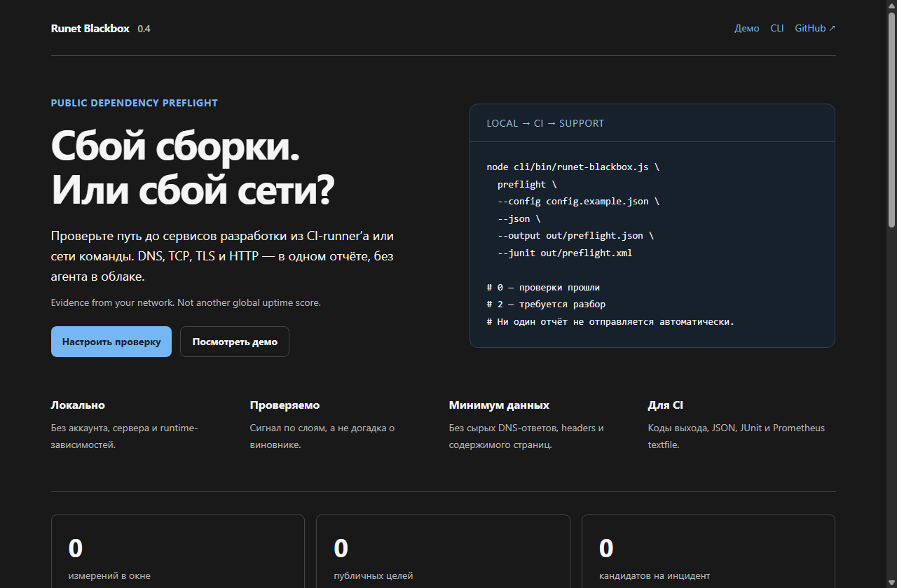
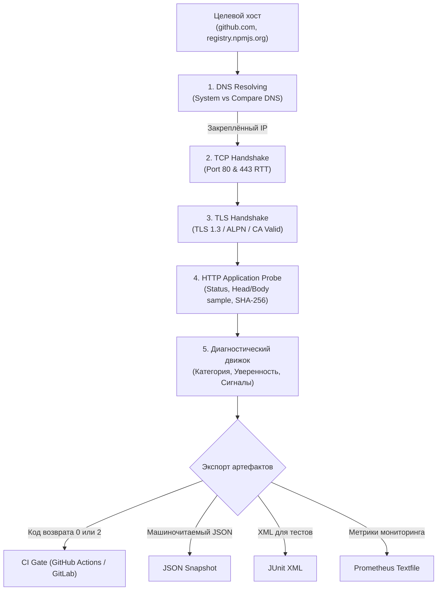

# 🌐 Runet Blackbox

<p align="center">
  <strong>Сбой сборки или сбой сети? Узнайте точно, на каком слое ломается доступ к публичным зависимостям.</strong><br>
  Локальная утилита префлайт-диагностики для CI-раннеров, DevOps и распределенных команд: <strong>DNS → TCP → TLS → HTTP</strong>.<br>
  Формирует понятный, доказуемый отчёт для инцидентов — <strong>без центрального сервера, без облачных аккаунтов и без сторонних npm-зависимостей</strong>.
</p>

<p align="center">
  
  
  
  
  
  
</p>

---

## 📸 Интерфейс и веб-дашборд

<p align="center">
  
</p>

> 💡 **Быстрый локальный запуск:** вы можете открыть встроенный статический интерфейс [`apps/web/index.html`](apps/web/index.html) прямо в браузере без сборки и веб-сервера.

---

## 🎯 Зачем нужен Runet Blackbox

Когда сборка на GitHub Actions или локальном сервере падает с ошибкой `fetch failed` или `ETIMEDOUT`, разработчики часто гадают: упал ли реестр (npm/PyPI/Docker Hub), чудит ли локальный DNS, или провайдер заблокировал маршрут.

**Runet Blackbox проверяет цепочку послойно и фиксирует факты, а не догадки:**

| Уровень проверки | Что проверяется | Защита и гарантии |
| :--- | :--- | :--- |
| 🌐 **DNS** | Резолв через системный резолвер с возможностью сравнения с 1.1.1.1 / 8.8.8.8 | Проверенный IP закрепляется (pinning) за всеми последующими TCP/TLS тестами. |
| 🔌 **TCP Handshake** | Прямое открытие сокетов на портах 80 и 443 | Фиксация точного RTT задержки сокета и детекция сбросов RST. |
| 🔒 **TLS 1.3 Handshake** | Проверка валидности сертификата и шифра | Отказ от небезопасных версий; защита от подмены сертификатов (MITM). |
| 📄 **HTTP Status & Body** | Финальный HTTP-код ответа, редиректы и хеш тела | Защита от перенаправлений на приватные подсети (SSRF) и страниц заглушек провайдеров. |

> [!IMPORTANT]
> **Это локальный инструмент доказательной диагностики.** Он не является VPN, прокси, сервисом обхода блокировок или глобальным пинг-мониторингом. Никакие данные не отправляются в облако.

---

## 🏗️ Послойный конвейер проверки



---

## ⚡ Быстрый старт за 60 секунд

Требуется **Node.js 22+**. Проект работает на нативном ESM без внешних npm-пакетов.

```bash
# 1. Клонирование
git clone https://github.com/etern1ty-crypto/runet-blackbox.git
cd runet-blackbox

# 2. Локальная проверка окружения
node cli/bin/runet-blackbox.js doctor

# 3. Диагностика конкретного сервиса
node cli/bin/runet-blackbox.js check github.com --json --pretty
```

---

## 💻 Диагностика в действии (Живые логи)

Пример реального выполнения команды `check github.com`:

```bash
node cli/bin/runet-blackbox.js check github.com --json --pretty
```

<details open>
<summary><b>Машиночитаемый JSON-отчёт проверки</b></summary>

```json
{
  "schema_version": "1.1",
  "tool_version": "0.4.0",
  "target": "github.com",
  "timestamp_utc": "2026-09-08T01:45:00.000Z",
  "results": {
    "dns": {
      "status": "ok",
      "latency_ms": 171,
      "addresses_count": 1,
      "resolver": "system"
    },
    "tcp_80": {
      "status": "ok",
      "latency_ms": 2,
      "port": 80
    },
    "tcp_443": {
      "status": "ok",
      "latency_ms": 2,
      "port": 443
    },
    "tls": {
      "status": "ok",
      "latency_ms": 486,
      "port": 443,
      "protocol": "TLSv1.3",
      "alpn": "http/1.1",
      "authorized": true
    },
    "http": {
      "status": "ok",
      "latency_ms": 955,
      "status_code": 200,
      "final_host": "github.com",
      "content_length": 65536,
      "body_sha256": "db0e4a3153b1e5b8a322abab4ef160b6d5e114f040fbe28b2fe9a0279620b450",
      "blockpage_suspected": false
    }
  },
  "diagnosis": {
    "category": "ok",
    "confidence": 0.94,
    "signals": [
      "dns, tcp, tls, and http checks passed"
    ]
  },
  "report_id": "rbb_4d806f2685a7fae4a75e"
}
```
</details>

---

## 🚀 Практические сценарии

### 1. Префлайт в CI/CD (остановка сборки при сбое сети)
Команда `preflight` возвращает код `0`, если все сервисы доступны, и код `2`, если хотя бы один слой упал:

```bash
node cli/bin/runet-blackbox.js preflight --pack ci --junit out/preflight.xml --prometheus out/preflight.prom
```

### 2. Разбор инцидента с альтернативным DNS
Сравнение поведения системного резолвера с Cloudflare DNS (1.1.1.1):

```bash
node cli/bin/runet-blackbox.js check registry.npmjs.org --compare-dns 1.1.1.1 --output out/incident.json
```

---

## 🧪 Тестирование и верификация

Качество изоляции сокетов, обработка таймаутов и безопасность парсинга подтверждены 366 автоматическими тестами:

```bash
npm test
```

```text
✔ mixed public/private DNS answers block all transport probes
✔ unsafe redirect is rejected without a second request: http://127.0.0.1/metadata
✔ unsafe redirect is rejected: file:///etc/passwd
✔ HTTPS never downgrades to cleartext
✔ TCP and TLS have wall-clock deadlines and close silent sockets
✔ dashboard rejects untrusted numeric/date shape
...
ℹ tests 366 | pass 366 | fail 0 | duration_ms 1595ms
```

---

## 📚 Справочник документации

| Документ | Описание |
| :--- | :--- |
| 🛠 [Справочник CLI](docs/CLI.md) | Все ключи запуска, таймауты, списки пакетов и коды выхода |
| 📖 [Архитектура](docs/ARCHITECTURE.md) | Модель послойных проб, pinning IP-адресов, политика SSRF |
| 📊 [Модель данных](docs/DATA_MODEL.md) | Схема отчётов, формат полей задержек и диагностических сигналов |
| 🔐 [Политика безопасности](SECURITY.md) | Threat Model, защита от SSRF, валидация редиректов |
| 🔍 [Аудит безопасности](docs/AUDIT.md) | Ревизия сетевых граничных условий и устраненные риски |
| ✅ [Протокол верификации](docs/VERIFICATION.md) | Локальный протокол выполнения тестовой матрицы |
| 🗺️ [Roadmap](ROADMAP.md) | Планы развития проекта |

---

## 📜 Лицензия

Проект распространяется под открытой лицензией [MIT](LICENSE).  
Авторские права © 2026 etern1ty-crypto.
